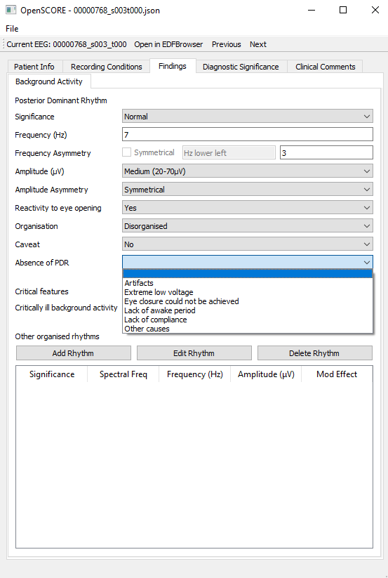

# OpenSCORE
An EEG reporting tool according to the SCORE standard.


- Create score reports
- Load and edit existing score reports
- Link EDF files to score reports
- Open the corresponding EDF files in EDFBrowser
- Initialise a score report using and EDF and existing
record description.
- Load multiple EDF files for multiple analysis.

## Installation

1. Download this repository
```shell script
git clone https://github.com/DWonGH/OpenSCORE.git
cd OpenSCORE
```

2. Install the python dependencies. They are described in the requirements.txt file.
We need to use python 3.6 as that is the latest some of the dependencies support. It 
is recommended to use a conda virtual environment like below:
```shell script
conda create -y -n openscore python=3.6
conda activate openscore
```

3. The requirements can be installed using pip.
```shell script
pip install -r requirements.txt
```

4. Install EDFBrowser  

OpenSCORE uses EDFBrowser to analyze EEG recordings. Go to [the repository](https://github.com/d3-worgan/edfbrowser/releases/tag/v1.0)
, download the zip file from the "Releases" section, and unzip into the root of this project directory.
Optionally try something like this
```shell script
curl https://github.com/d3-worgan/edfbrowser/releases/tag/v1.0
```

There should now be a directory called 'release' in the root of the project directory.
Inside is the EDFBrowser application.

4. Run
```shell script
python main.py
```

## Development
The project structure loosely follows the MVC design pattern:
- The views in the ```src/views``` directory are essentially Qt Widgets. 
Files in the views directory should generally only contain code for specifying the 
widgets and layout.
- The once the view/ widget is created, it is tied to a controller which is where we
"connect" the widgets in the view to action code. E.g. tying the push
buttons to handler (hdl) methods.
- The controllers take data from the view and update the data model (or vice
versa). They also control opening dialogs etc.
- The models are then used to build the report and can be written or opened
from persisted files.
- The tests follow the same structure as the source code. Each test case needs
to be added to the main test file in the project root.